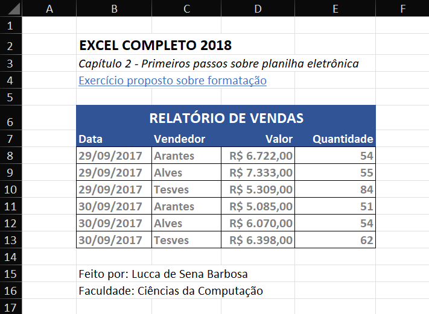

# Planilhas Excel 📈

📌 Neste repositório, estarei armazenando algumas planilhas feitas por mim com o objetivo de fixar e aprimorar os meus conhecimentos a respeito dessa ferramenta essencial para o mercado de trabalho. 

    

- Logo abaixo, você encontrará alguns dos meus documentos em formato .xlsx:

    <a href="documentos/exercicio-proposto-formatacao.xlsx">1. Exercício proposto sobre formatação</a>  
    
    
Exercício que deu inicio ao meu estudo no excel e nele apliquei conceitos básicos de formatação de textos e na tabela como um todo.

