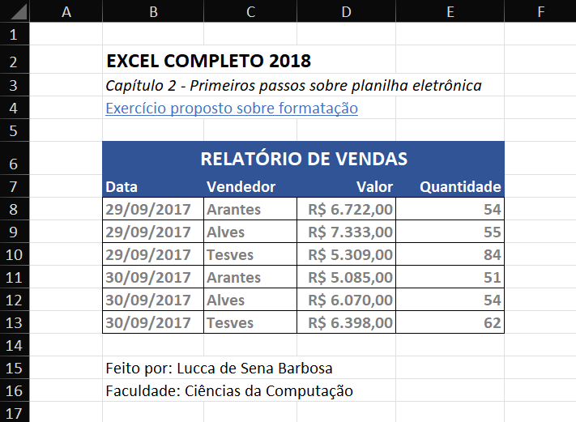
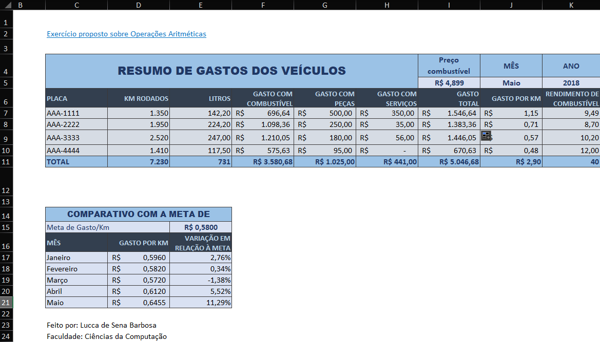

# Exercícios Propostos 📈

📌 Nesta seção, vou estar armazenando alguns exercícios propostos respectivos ao assunto estudado. Para isto, estou retirando os exercícios de um curso na udemy ministrada pelo <b>professor Nelio Alves.</b> Disponibilizo o link do curso abaixo:

<a ref="https://www.udemy.com/share/101rzY3@-n8JffPb5GriVX6XjKeABPfs0flX7H4EO3kI1MRYltjUhDaK6VWYKBsoj55NZsP2_w==/" >Curso Excel</a>

  

Abaixo, se encontra alguma das planilhas:

<a href="exercicio-proposto-formatacao.xlsx">1. Exercício Propostos sobre formatação</a>

Exercício que deu inicio ao meu estudo no excel e nele apliquei conceitos básicos de formatação de textos e na tabela como um todo.

 

<a href="exercicio-proposto-operacoes-aritmeticas.xlsx">2. Exercício Propostos sobre Operações Aritméticas</a> 

 

Neste exercício, apliquei conceitos básicos de fórmulas aonde os resultados como o Gasto Total; Gasto por KM; Rendimento de Combustível e Variação em Meta sejam calculados automaticamentes mesmo se algum atributo na tabela seja alterado. Para entender como esses cálculos foram realizados irei dar de exemplo a linha 7 e 17:

<ul>
    <li><b>Gasto Total:</b> =F7+G7+H7</li>
    <li><b>Gasto por KM:</b> =I7/D7</li>
    <li><b>Rendimento de Combustível:</b> =D7/E7</li>
    <li><b>Variação em Relação à Meta:</b> = (D17 /$E$15) - 1</li>
</ul>

Como visto, para os cálculos indiquei o índice da célula que irá ser utilizado e por isso se um valor for alterado, o cálculo será reajustado automatizamente. Esta mesma lógica se estende para os demais registros. É importante destacar o valor <b>$E$15</b> que indica uma refêrencia absoluta, ou seja, o programa vai utilizar unicamente esse valor para os demais cálculos.

