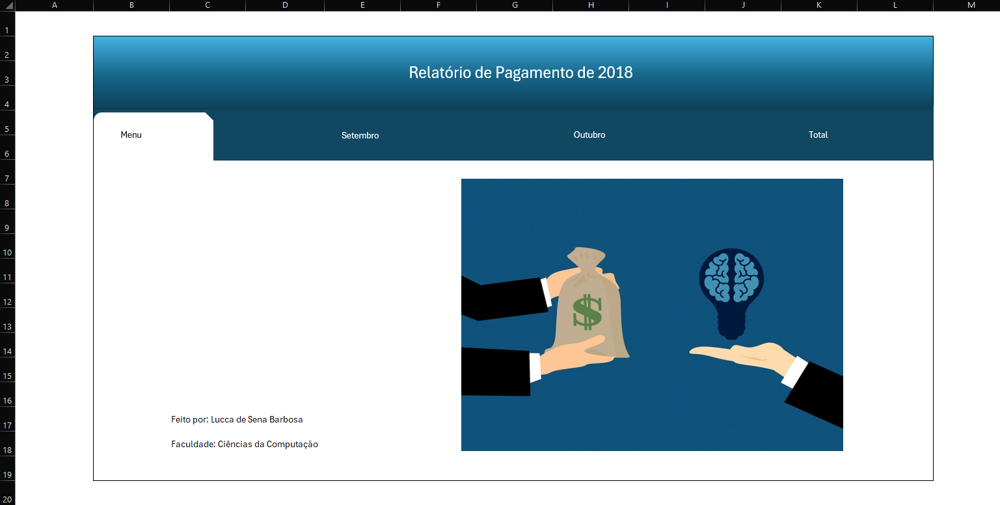
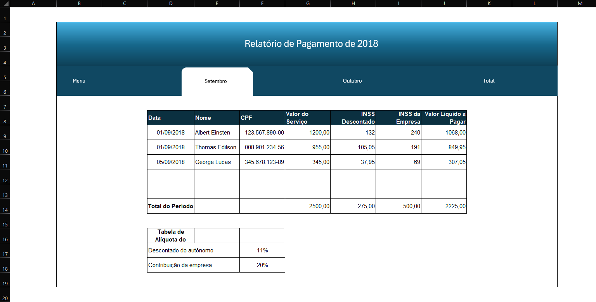
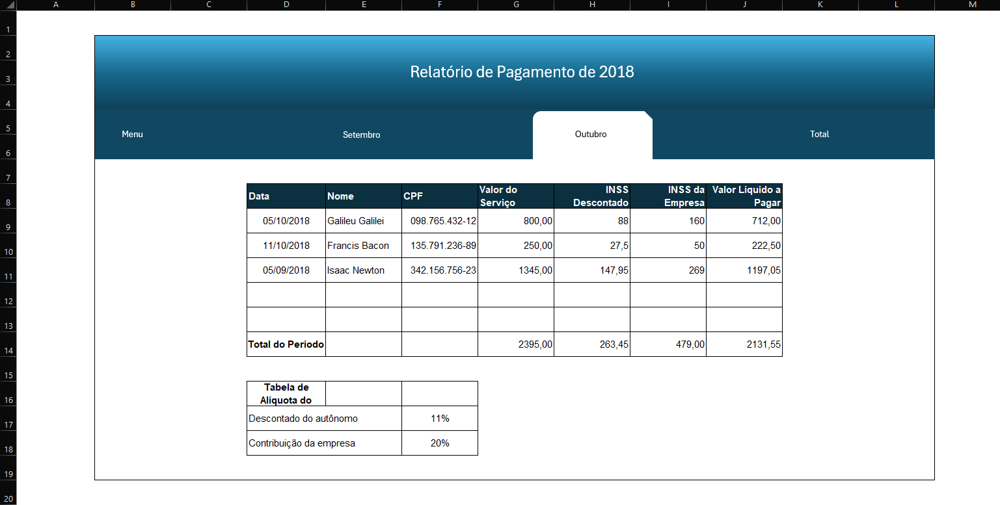

# Relatório de Pagamentos - 📋

- Neste projeto, desenvolvi uma interface que disponibiliza planilhas relacionadas aos relatórios de pagamentos realizados nos meses de setembro e outubro. Ao final, é realizado um cálculo que soma os pagamentos referentes a esses dois meses.

<a href="RPA-2018.xlsx">Relatório de Pagamento - Arquivo</a>

## 1. Menu:

</img>

## 2. Mês de Setembro:

</img>

## 3. Mês de Outubro:

</img>

## 4. Total:

</img>

- <b>Observação</b>: Para realizar os cálculos do INSS Descontado; INSS da Empresa e Valor Líquido Pago nos meses de Setembro e Outubro, utilizamos o Valor do Serviço e a Tabela da Alíquota do INSS para montar as fórmulas nas colunas citadas inicialmente. Portanto, caso algum valor seja alterado, automaticamente os cálculos serão ajustados.